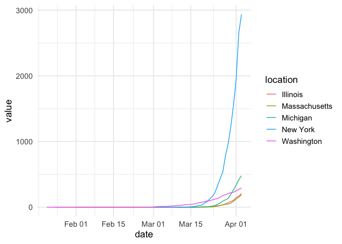

<!-- README.md is generated from README.Rmd. Please edit that file -->

# covid19nytimes

<!-- badges: start -->

[](https://www.tidyverse.org/lifecycle/#maturing)
[](https://CRAN.R-project.org/package=covid19nytimes)
[](https://travis-ci.org/Covid19R/covid19nytimes)
<!-- badges: end -->

The covid19nytimes package harvests the data made freely available by
the New York Times. See
<https://www.nytimes.com/article/coronavirus-county-data-us.html> for
more.

## Installation

You can install the released version of covid19nytimes from
[CRAN](https://CRAN.R-project.org) with:

``` r
install.packages("covid19nytimes")
```

Or the latest development version from
[github](https://github.com/covid19R/covid19nytimes)

``` r
devtools::install_github("covid19R/covid19nytimes")
```

## Data

The package has the data from states and counties. The package comes
with static data that was downloaded at the time of the last package
update.

``` r
library(covid19nytimes)

head(covid19nytimes_states_demo) %>% knitr::kable()
```

| date       | location   | location\_type | location\_standardized | location\_standardized\_type | data\_type    | value |
| :--------- | :--------- | :------------- | :--------------------- | :--------------------------- | :------------ | ----: |
| 2020-01-21 | Washington | state          | 53                     | fips\_code                   | cases\_total  |     1 |
| 2020-01-21 | Washington | state          | 53                     | fips\_code                   | deaths\_total |     0 |
| 2020-01-22 | Washington | state          | 53                     | fips\_code                   | cases\_total  |     1 |
| 2020-01-22 | Washington | state          | 53                     | fips\_code                   | deaths\_total |     0 |
| 2020-01-23 | Washington | state          | 53                     | fips\_code                   | cases\_total  |     1 |
| 2020-01-23 | Washington | state          | 53                     | fips\_code                   | deaths\_total |     0 |

``` r

head(covid19nytimes_counties_demo) %>% knitr::kable()
```

| date       | location             | location\_type | location\_standardized | location\_standardized\_type | data\_type    | value |
| :--------- | :------------------- | :------------- | :--------------------- | :--------------------------- | :------------ | ----: |
| 2020-01-21 | Snohomish,Washington | county\_state  | 53061                  | fips\_code                   | cases\_total  |     1 |
| 2020-01-21 | Snohomish,Washington | county\_state  | 53061                  | fips\_code                   | deaths\_total |     0 |
| 2020-01-22 | Snohomish,Washington | county\_state  | 53061                  | fips\_code                   | cases\_total  |     1 |
| 2020-01-22 | Snohomish,Washington | county\_state  | 53061                  | fips\_code                   | deaths\_total |     0 |
| 2020-01-23 | Snohomish,Washington | county\_state  | 53061                  | fips\_code                   | cases\_total  |     1 |
| 2020-01-23 | Snohomish,Washington | county\_state  | 53061                  | fips\_code                   | deaths\_total |     0 |

## Getting the Most Up to Date Data

To get the most updated data, run the following functions

``` r
covid19nytimes_states <- refresh_covid19nytimes_states()

covid19nytimes_counties <- refresh_covid19nytimes_counties()
```

## Columns

The data follows the covid19R standard for tidy Covid-19 data. The data
columns are as follows:

  - date - The date in YYYY-MM-DD form
  - location - The name of the location as provided by the data source.
    The counties dataset provides county and state. They are combined
    and separated by a `,`, and can be split by `tidyr::separate()`, if
    you wish.
  - location\_type - The type of location using the covid19R controlled
    vocabulary. Nested locations are indicated by multiple location
    types being combined with a \`\_
  - location\_code - A standardized location code using a national or
    international standard. In this case, FIPS state or county codes.
    See
    <https://en.wikipedia.org/wiki/Federal_Information_Processing_Standard_state_code>
    and <https://en.wikipedia.org/wiki/FIPS_county_code> for more
  - location\_code\_type The type of standardized location code being
    used according to the covid19R controlled vocabulary. Here we use
    `fips_code`
  - data\_type - the type of data in that given row. Includes
    `total_cases` and `total_deaths`, cumulative measures of both.
  - value - number of cases of each data type

## Sample visualization

``` r
library(dplyr)
#> 
#> Attaching package: 'dplyr'
#> The following objects are masked from 'package:stats':
#> 
#>     filter, lag
#> The following objects are masked from 'package:base':
#> 
#>     intersect, setdiff, setequal, union
library(ggplot2)

covid19nytimes_states %>%
  filter(location %in% c("Washington", "New York", "Massachusetts", "Michigan", "Illinois")) %>%
  filter(data_type == "deaths_total") %>%
  ggplot(aes(x = date, y = value, color = location)) +
  geom_line() +
  theme_minimal(base_size=14) +
  scale_y_continuous()
```


